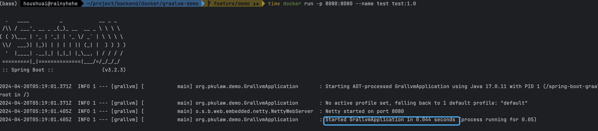

# Graalvm Demo
> 本工程是[GraalVm](https://www.graalvm.org/latest/docs/getting-started/)打包二进制的demo

# 包含内容
1. 基础镜像（包含graalvm 17 和 gradle 8.7）--> [docker_base](DockerfileBase)
2. 工程构建镜像 [dockerfile](Dockerfile)

# 对比
> 对比原始java和二进制启动时间的差异。

- 二进制包

- 原始java
