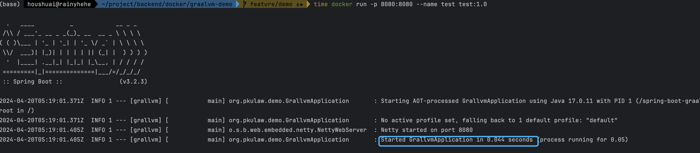
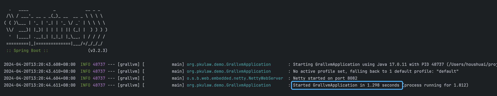

# Graalvm Demo
> This project demonstrates packaging binaries with [GraalVm](https://www.graalvm.org/).

# Contents
1. Base image (including GraalVM 17 and Gradle 8.7) --> [docker_base](DockerfileBase)
2. Project build image [dockerfile](Dockerfile)

# Comparison
> Comparison of startup time between original Java and binaries.

- Binary package

- Original Java
